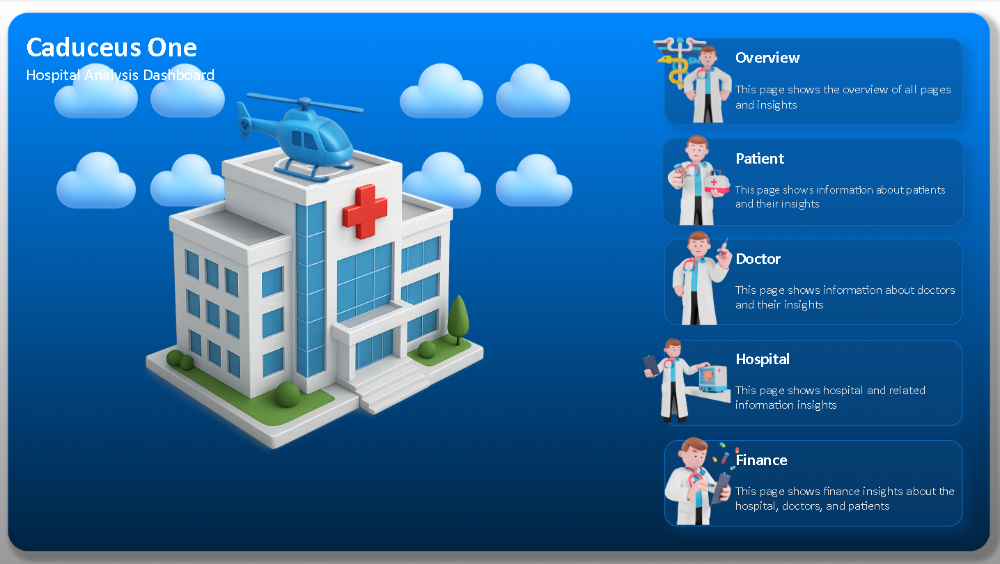
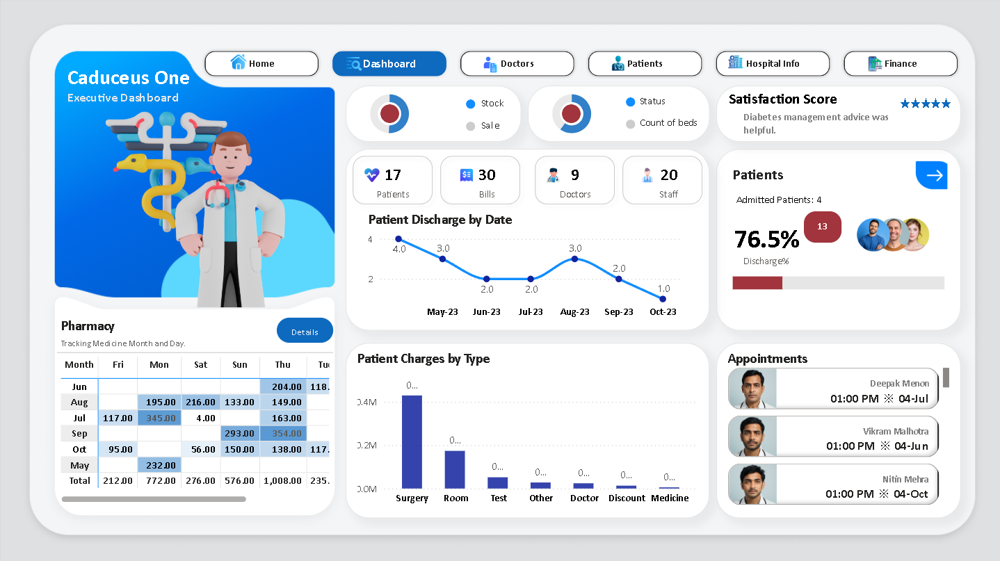
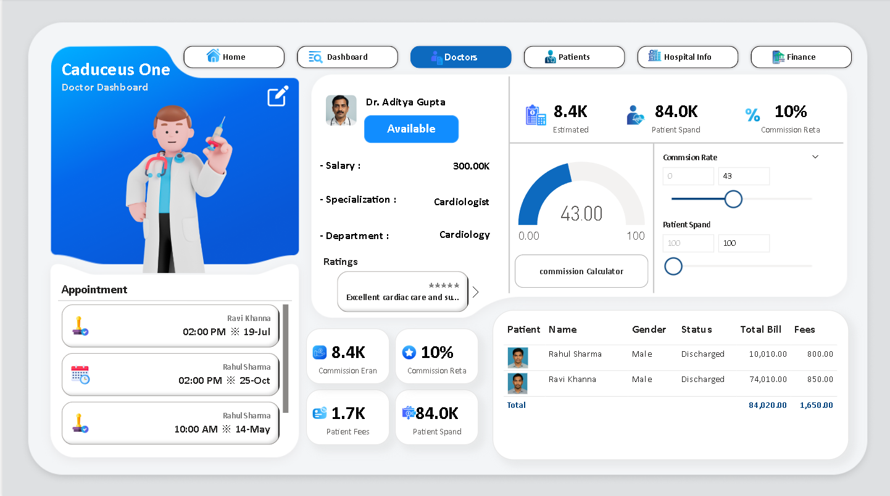
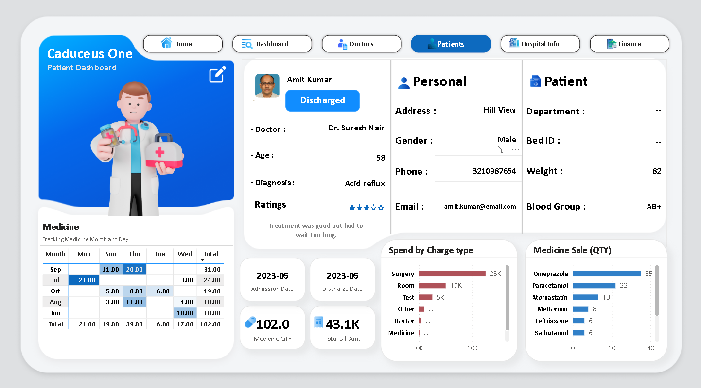
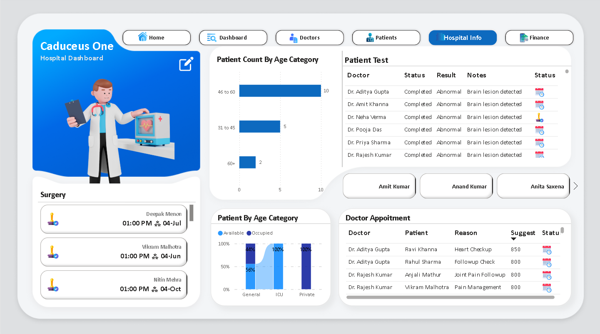
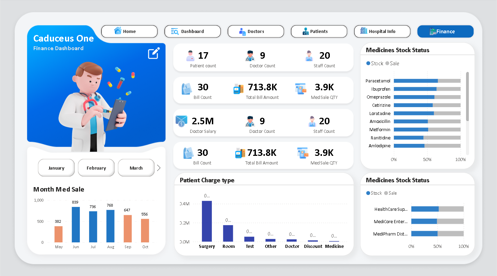

# Caduceus-One-Hospital-Dashboard

A comprehensive hospital management dashboard system providing real-time analytics and insights for healthcare facilities. This project integrates multiple data sources to deliver interactive visualizations for patient care, doctor performance, financial management, and hospital operations.


## 🚀 Features

- **Multi-Dimensional Dashboards**: Overview, Patient, Doctor, Hospital, and Finance dashboards
- **Pharmacy & Medicine Tracking**: Inventory management and sales analytics
- **Patient Management**: Admission, discharge, and treatment tracking
- **Doctor Performance Analytics**: Appointment scheduling, commission tracking, and ratings
- **Financial Insights**: Revenue analysis, expense tracking, and financial reporting
- **Interactive Visualizations**: Charts, graphs, and KPIs for data-driven decision making
- **Role-Based Security**: Row-level security (RLS) implementation for data protection

## 🛠️ Technology Stack

- **Power BI**: Advanced data visualizations and interactive reports
- **SQL**: Database management and complex query operations
- **Excel**: Data processing and preliminary analysis
- **DAX**: Advanced calculations and measures
- **Power Query**: Data transformation and ETL processes


## 📊 Dashboard Previews

### Home 


### Overview Dashboard

*Comprehensive view of hospital operations with key performance indicators*

### Doctor Performance Dashboard

*Doctor analytics including appointments, ratings, and commission tracking*

### Patient Dashboard


### Hospital Info Dashboard


### Financial Analytics Dashboard

*Financial insights with revenue analysis and expense tracking*

## 🏥 Use Cases

- Healthcare administrators seeking operational insights
- Hospital management optimizing resource allocation
- Medical professionals needing patient and treatment analytics
- Healthcare IT developers working on hospital management systems
- Financial analysts tracking hospital revenue and expenses

## 🔧 Installation & Setup

### Prerequisites
- Power BI Desktop (latest version)
- SQL Server Management Studio (optional)
- Microsoft Excel

### Quick Start
1. Clone the repository:
```bash
git clone https://github.com/your-username/Caduceus-One-Hospital-Dashboard.git


